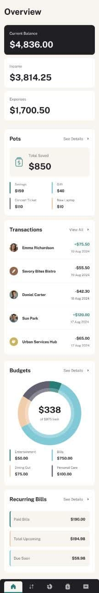

# 💰 Personal Finance App

A personal finance management application built with **React 19**, **Vite**, and **Tailwind CSS**.  
It allows users to track their balance, budgets, recurring bills, transactions, and savings (Pots).

---

## 📷 Preview
### Desktop


### Tablet


### Mobile


---

## 🚀 Tech Stack

### Main Dependencies
-  **React 19.1.0**
-  **React DOM 19.1.0**
-  **React Router DOM 7.7.1** (routing)
-  **React Icons 5.5.0** (icon library)
-  **Recharts 3.1.2** (charts & graphs)

### Dev Dependencies
- ⚡ **Vite 7.0.4** (build tool)
- 🎨 **Tailwind CSS 3.4.17**
- 🔧 **ESLint 9.30.1** with React hooks & refresh plugins
- ✨ **PostCSS 8.5.6** + **Autoprefixer 10.4.21**

---


## ✨ Features
- Display **current balance, income, and expenses**
- Manage **Pots** (savings goals)
- Budget section with **interactive pie chart**
- Recent transactions list
- Recurring bills overview
- Fully **responsive design** (mobile, tablet, desktop)

---

## ⚙️ Installation & Setup
```bash
# Clone the repository
git clone https://github.com/USERNAME/personal-finance-app.git

# Navigate into the project folder
cd personal-finance-app

# Install dependencies
npm install

# Start the development server
npm run dev
